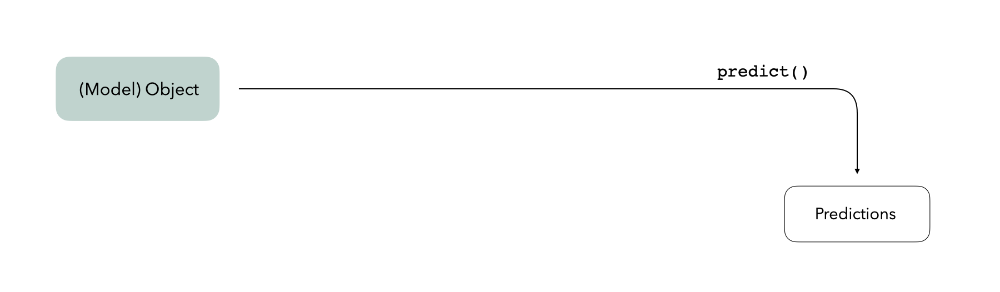
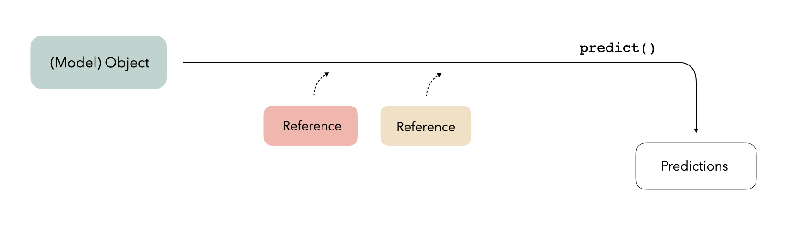

<!-- README.md is generated from README.Rmd. Please edit that file -->

```{r, include = FALSE}
should_eval <- 
  rlang::is_installed("xgboost") && 
  rlang::is_installed("parsnip") &&
  rlang::is_installed("callr")

knitr::opts_chunk$set(
  collapse = TRUE,
  comment = "#>",
  fig.path = "man/figures/README-",
  out.width = "100%",
  eval = should_eval
)
```

# bundle

_NOTE: This package is very early on in its development and is not yet minimally functional._

<!-- badges: start -->
[](https://lifecycle.r-lib.org/articles/stages.html#experimental)
[](https://CRAN.R-project.org/package=bundle)
[](https://app.codecov.io/gh/rstudio/bundle?branch=main)
[](https://github.com/rstudio/bundle/actions/workflows/R-CMD-check.yaml)
<!-- badges: end -->

R holds most objects in memory. However, some models store their data in locations that are not included when one uses `save()` or `saveRDS()`. bundle provides a common API to capture this information, situate it within a portable object, and restore it for use in new settings.

## Installation

You can install the development version of bundle like so:

``` r
pak::pak("simonpcouch/bundle")
```

## Overview

We often imagine a trained model as a somewhat "standalone" R object---given some new data, the object can generate predictions on its own:

```{r diagram-01, echo = FALSE, fig.alt = "A diagram showing a rectangle, labeled model object, and another rectangle, labeled predictions. The two are connected by an arrow from model object to predictions, with the label predict.", out.width = '100%'}

```

In reality, model objects also make use of _references_ to generate predictions. A reference is a piece of data that a model object refers to that isn't part of the object itself---this could be anything from a connection with a server to an internal function in the package used to train the model. Under the hood, when we call `predict()`, model objects know where to look to retrieve that data:

```{r diagram-02, echo = FALSE, fig.alt = "A diagram showing the same pair of rectangles as before, connected by the arrow labeled predict. This time, though, we introduce two boxes labeled reference. These two boxes are connected to the arrow labeled predict with dotted arrows, to show that, most of the time, we don't need to think about including them in our workflow.", out.width = '100%'}

```

Saving model objects can sometimes disrupt those references. Thus, if we want to train a model, save it, re-load it in a production setting, and generate predictions with it, we may run into issues:

```{r diagram-03, echo = FALSE, fig.alt = "A diagram showing the same set of rectangles, representing a prediction problem, as before. This version of the diagram adds two boxes, labeled R Session numbe r one, and R session number two. In R session number two, we have a new rectangle labeled standalone model object. In focus is the arrow from the model object, in R Session number one, to the standalone model object in R session number two.", out.width = '100%'}
knitr::include_graphics("man/figures/diagram_03.png")
```

We thus need some way to preserve access to those references. This package provides a consistent interface for _bundling_ model objects with their references so that they can be safely saved and re-loaded in production:

```{r diagram-04, echo = FALSE, fig.alt = "A replica of the previous diagram, where the arrow previously connecting the model object in R session one and the standalone model object in R session two is connected by a verb called bundle. The bundle function outputs an object called a bundle.", out.width = '100%'}
knitr::include_graphics("man/figures/diagram_04.png")
```

So, when you're ready to save your model, `bundle()` it first, and once you've loaded it in a new setting, `unbundle()` it. It's that simple!

## Example

bundle prepares model objects so that they can be effectively saved and re-loaded for use in new R sessions. To demonstrate using bundle, we will train a boosted tree model, bundle it, and then pass the bundle into another R session to generate predictions on new data.

First, loading needed packages:

```{r example, message = FALSE, warning = FALSE}
library(bundle)
library(parsnip)
library(callr)
library(waldo)
```

Fitting the boosted tree model:

```{r}
# fit an boosted tree with xgboost via parsnip
mod <-
    boost_tree(trees = 5, mtry = 3) %>%
    set_mode("regression") %>%
    set_engine("xgboost") %>%
    fit(mpg ~ ., data = mtcars[1:25,])

mod
```

Note that simply saving and loading the model results in changes to the fitted model:

```{r}
temp_file <- tempfile()
saveRDS(mod, temp_file)
mod2 <- readRDS(temp_file)

compare(mod, mod2, ignore_formula_env = TRUE)
```

Saving and reloading `mod2` didn't preserve xgboost's reference to its `pointer`, which may result in failures later in the modeling process.

We thus need to prepare the fitted model to be saved before passing it to another R session. We can do so by bundling it:

```{r}
# bundle the model
bundled_mod <-
  bundle(mod)

bundled_mod
```

Passing the model to another R session and generating predictions on new data:

```{r}
# load the model in a fresh R session and predict on new data
r(
  func = function(bundled_mod) {
    library(bundle)
    library(parsnip)
    
    unbundled_mod <- 
      unbundle(bundled_mod)

    predict(unbundled_mod, new_data = mtcars[26:32,])
  },
  args = list(
    bundled_mod = bundled_mod
  )
)
```

For a more in-depth demonstration of the package, see the main vignette with:

```{r, eval = FALSE}
vignette("bundle")
```

## Code of Conduct
  
Please note that the bundle project is released with a [Contributor Code of Conduct](https://contributor-covenant.org/version/2/1/CODE_OF_CONDUCT.html). By contributing to this project, you agree to abide by its terms.
