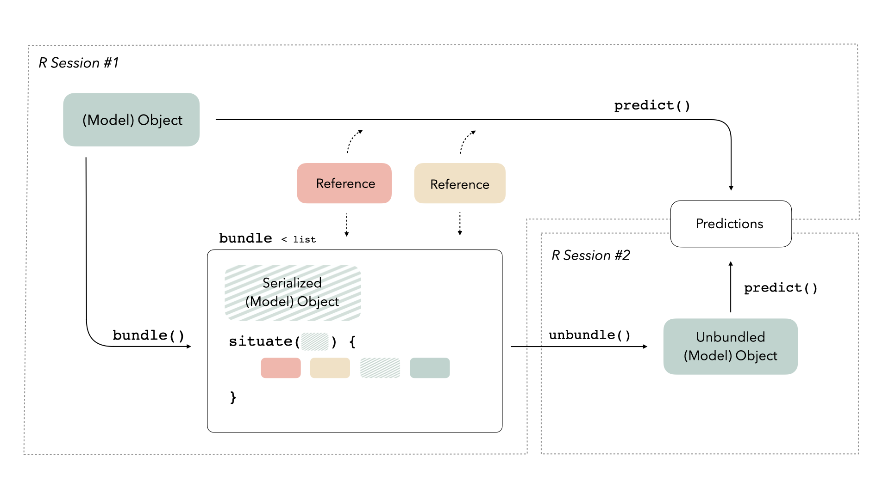

<!-- README.md is generated from README.Rmd. Please edit that file -->

# bundle

<!-- badges: start -->

[](https://github.com/rstudio/bundle/actions/workflows/R-CMD-check.yaml)
[](https://lifecycle.r-lib.org/articles/stages.html#experimental)
[](https://app.codecov.io/gh/rstudio/bundle?branch=main)
<!-- badges: end -->

Typically, models in R exist in memory and can be saved as `.rds` files.
However, some models store information in locations that cannot be saved
using `save()` or `saveRDS()` directly. The goal of bundle is to provide
a common interface to capture this information, situate it within a
portable object, and restore it for use in new settings.

## Installation

You can install the released version of vetiver from
[CRAN](https://CRAN.R-project.org) with:

``` r
install.packages("bundle")
```

And the development version from [GitHub](https://github.com/) with:

``` r
# install.packages("devtools")
devtools::install_github("rstudio/bundle")
```

## Overview

We often imagine a trained model as a somewhat “standalone” R
object—given some new data, the R object can generate predictions on its
own. In reality, some types of model objects also make use of
*references* to generate predictions. A reference is a piece of
information that a model object refers to that isn’t part of the object
itself; this could be anything from a connection with a server to an
internal function in the package used to train the model. When we call
`predict()`, model objects know where to look to retrieve that data, but
saving model objects can sometimes disrupt those references. Thus, if we
want to train a model, save it, re-load it into memory in a production
setting, and generate predictions with it, we may run into issues
because those references do not exist in the new computational
environment.

We need some way to preserve access to those references. The bundle
package provides a consistent interface for *bundling* model objects
with their references so that they can be safely saved and re-loaded in
production:



For more on this diagram, see the [main bundle
vignette](https://rstudio.github.io/bundle/articles/bundle.html).

When you’re ready to save your model, `bundle()` it first. Once you’ve
loaded it in a new setting, `unbundle()` it!

## Example

The bundle package prepares model objects so that they can be
effectively saved and re-loaded for use in new R sessions. To
demonstrate using bundle, we will train a boosted tree model using
[XGBoost](https://xgboost.readthedocs.io/), bundle it, and then pass the
bundle into another R session to generate predictions on new data.

First, load needed packages:

``` r
library(bundle)
library(parsnip)
library(callr)
library(waldo)
```

Fit the boosted tree model:

``` r
# fit an boosted tree with xgboost via parsnip
mod <-
    boost_tree(trees = 5, mtry = 3) %>%
    set_mode("regression") %>%
    set_engine("xgboost") %>%
    fit(mpg ~ ., data = mtcars[1:25,])

mod
#> parsnip model object
#> 
#> ##### xgb.Booster
#> raw: 8.1 Kb 
#> call:
#>   xgboost::xgb.train(params = list(eta = 0.3, max_depth = 6, gamma = 0, 
#>     colsample_bytree = 1, colsample_bynode = 0.3, min_child_weight = 1, 
#>     subsample = 1, objective = "reg:squarederror"), data = x$data, 
#>     nrounds = 5, watchlist = x$watchlist, verbose = 0, nthread = 1)
#> params (as set within xgb.train):
#>   eta = "0.3", max_depth = "6", gamma = "0", colsample_bytree = "1", colsample_bynode = "0.3", min_child_weight = "1", subsample = "1", objective = "reg:squarederror", nthread = "1", validate_parameters = "TRUE"
#> xgb.attributes:
#>   niter
#> callbacks:
#>   cb.evaluation.log()
#> # of features: 10 
#> niter: 5
#> nfeatures : 10 
#> evaluation_log:
#>  iter training_rmse
#>     1     14.695244
#>     2     10.903444
#>     3      8.231602
#>     4      6.256097
#>     5      4.757736
```

Note that simply saving and loading the model results in changes to the
fitted model:

``` r
temp_file <- tempfile()
saveRDS(mod, temp_file)
mod2 <- readRDS(temp_file)

compare(mod, mod2, ignore_formula_env = TRUE)
#> `old$fit$handle` is <pointer: 0x13cf89a60>
#> `new$fit$handle` is <pointer: 0x0>
#> 
#> `old$fit$handle` is attr(,"class")
#> `new$fit$handle` is attr(,"class")
#> 
#> `old$fit$handle` is [1] "xgb.Booster.handle"
#> `new$fit$handle` is [1] "xgb.Booster.handle"
```

Saving and reloading `mod2` didn’t preserve XGBoost’s reference to its
`pointer`, which may result in failures later in the modeling process.

We thus need to prepare the fitted model to be saved before passing it
to another R session. We can do so by bundling it:

``` r
# bundle the model
bundled_mod <-
  bundle(mod)

bundled_mod
#> bundled model_fit object.
```

Passing the model to another R session and generating predictions on new
data:

``` r
# load the model in a fresh R session and predict on new data
r(
  func = function(bundled_mod) {
    library(bundle)
    library(parsnip)
    
    unbundled_mod <- 
      unbundle(bundled_mod)

    predict(unbundled_mod, new_data = mtcars[26:32,])
  },
  args = list(
    bundled_mod = bundled_mod
  )
)
#> # A tibble: 7 × 1
#>   .pred
#>   <dbl>
#> 1  21.9
#> 2  18.2
#> 3  18.2
#> 4  14.9
#> 5  15.7
#> 6  12.8
#> 7  20.4
```

For a more in-depth demonstration of the package, see the [main
vignette](https://rstudio.github.io/bundle/articles/bundle.html) with
`vignette("bundle")`.

## Contributing

This project is released with a [Contributor Code of
Conduct](https://contributor-covenant.org/version/2/0/CODE_OF_CONDUCT.html).
By contributing to this project, you agree to abide by its terms.

-   For questions and discussions about our packages, modeling, and
    machine learning, please [post on RStudio
    Community](https://community.rstudio.com/new-topic?category_id=15&tags=question).

-   If you think you have encountered a bug, please [submit an
    issue](https://github.com/rstudio/bundle/issues).

-   Either way, learn how to create and share a
    [reprex](https://reprex.tidyverse.org/articles/articles/learn-reprex.html)
    (a minimal, reproducible example), to clearly communicate about your
    code.
