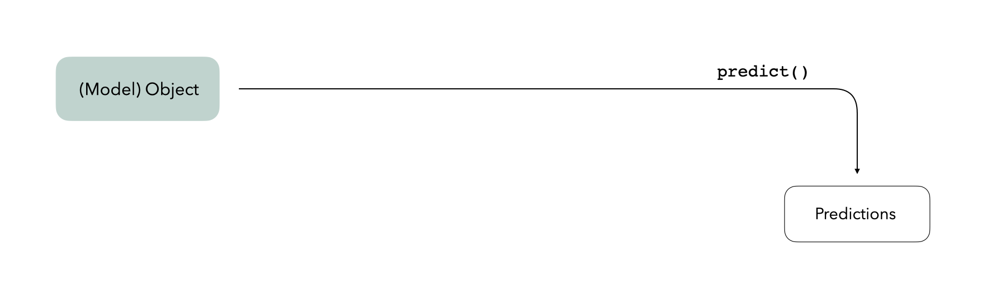

<!-- README.md is generated from README.Rmd. Please edit that file -->

# bundle

*NOTE: This package is very early on in its development and is not yet
minimally functional.*

<!-- badges: start -->

[](https://lifecycle.r-lib.org/articles/stages.html#experimental)
[](https://CRAN.R-project.org/package=bundle)
[](https://app.codecov.io/gh/rstudio/bundle?branch=main)
[](https://github.com/rstudio/bundle/actions/workflows/R-CMD-check.yaml)
<!-- badges: end -->

R holds most objects in memory. However, some models store their data in
locations that are not included when one uses `save()` or `saveRDS()`.
bundle provides a common API to capture this information, situate it
within a portable object, and restore it for use in new settings.

## Installation

You can install the development version of bundle like so:

``` r
pak::pak("simonpcouch/bundle")
```

## Overview

We often imagine a trained model as a somewhat “standalone” R
object—given some new data, the object can generate predictions on its
own:



In reality, model objects also make use of *references* to generate
predictions. A reference is a piece of data that a model object refers
to that isn’t part of the object itself—this could be anything from a
connection with a server to an internal function in the package used to
train the model. Under the hood, when we call `predict()`, model objects
know where to look to retrieve that data:


Saving model objects can sometimes disrupt those references. Thus, if we
want to train a model, save it, re-load it in a production setting, and
generate predictions with it, we may run into issues:


We thus need some way to preserve access to those references. This
package provides a consistent interface for *bundling* model objects
with their references so that they can be safely saved and re-loaded in
production:


So, when you’re ready to save your model, `bundle()` it first, and once
you’ve loaded it in a new setting, `unbundle()` it. It’s that simple!

## Example

bundle prepares model objects so that they can be effectively saved and
re-loaded for use in new R sessions. To demonstrate using bundle, we
will train a boosted tree model, bundle it, and then pass the bundle
into another R session to generate predictions on new data.

First, loading needed packages:

``` r
library(bundle)
library(parsnip)
library(callr)
library(waldo)
```

Fitting the boosted tree model:

``` r
# fit an boosted tree with xgboost via parsnip
mod <-
    boost_tree(trees = 5, mtry = 3) %>%
    set_mode("regression") %>%
    set_engine("xgboost") %>%
    fit(mpg ~ ., data = mtcars[1:25,])

mod
#> parsnip model object
#> 
#> ##### xgb.Booster
#> raw: 8.1 Kb 
#> call:
#>   xgboost::xgb.train(params = list(eta = 0.3, max_depth = 6, gamma = 0, 
#>     colsample_bytree = 1, colsample_bynode = 0.3, min_child_weight = 1, 
#>     subsample = 1, objective = "reg:squarederror"), data = x$data, 
#>     nrounds = 5, watchlist = x$watchlist, verbose = 0, nthread = 1)
#> params (as set within xgb.train):
#>   eta = "0.3", max_depth = "6", gamma = "0", colsample_bytree = "1", colsample_bynode = "0.3", min_child_weight = "1", subsample = "1", objective = "reg:squarederror", nthread = "1", validate_parameters = "TRUE"
#> xgb.attributes:
#>   niter
#> callbacks:
#>   cb.evaluation.log()
#> # of features: 10 
#> niter: 5
#> nfeatures : 10 
#> evaluation_log:
#>  iter training_rmse
#>     1     14.631798
#>     2     10.905053
#>     3      8.219282
#>     4      6.258573
#>     5      4.764464
```

Note that simply saving and loading the model results in changes to the
fitted model:

``` r
temp_file <- tempfile()
saveRDS(mod, temp_file)
mod2 <- readRDS(temp_file)

compare(mod, mod2)
#> `old$fit$handle` is <pointer: 0x132393ef0>
#> `new$fit$handle` is <pointer: 0x0>
#> 
#> `old$fit$handle` is attr(,"class")
#> `new$fit$handle` is attr(,"class")
#> 
#> `old$fit$handle` is [1] "xgb.Booster.handle"
#> `new$fit$handle` is [1] "xgb.Booster.handle"
#> 
#> `parent.env(parent.env(attr(old$preproc$terms, '.Environment')))` is length 5
#> `parent.env(parent.env(attr(new$preproc$terms, '.Environment')))` is length 4
#> 
#> names(parent.env(parent.env(attr(old$preproc$terms, '.Environment')))) vs names(parent.env(parent.env(attr(new$preproc$terms, '.Environment'))))
#>   "..."
#>   "mod"
#> - "mod2"
#>   "should_eval"
#>   "temp_file"
#> 
#> `parent.env(parent.env(attr(old$preproc$terms, '.Environment')))$mod$fit$handle` is <pointer: 0x132393ef0>
#> `parent.env(parent.env(attr(new$preproc$terms, '.Environment')))$mod$fit$handle` is <pointer: 0x0>
#> 
#> `parent.env(parent.env(attr(old$preproc$terms, '.Environment')))$mod$fit$handle` is attr(,"class")
#> `parent.env(parent.env(attr(new$preproc$terms, '.Environment')))$mod$fit$handle` is attr(,"class")
#> 
#> `parent.env(parent.env(attr(old$preproc$terms, '.Environment')))$mod$fit$handle` is [1] "xgb.Booster.handle"
#> `parent.env(parent.env(attr(new$preproc$terms, '.Environment')))$mod$fit$handle` is [1] "xgb.Booster.handle"
#> 
#> `parent.env(parent.env(attr(old$preproc$terms, '.Environment')))$mod2` is an S3 object of class <_xgb.Booster/model_fit>, a list
#> `parent.env(parent.env(attr(new$preproc$terms, '.Environment')))$mod2` is absent
```

Saving and reloading `mod2` didn’t preserve xgboost’s reference to its
`pointer`, which may result in failures later in the modeling process.

We thus need to prepare the fitted model to be saved before passing it
to another R session. We can do so by bundling it:

``` r
# bundle the model
bundled_mod <-
  bundle(mod)

bundled_mod
#> bundled model_fit object.
```

Passing the model to another R session and generating predictions on new
data:

``` r
# load the model in a fresh R session and predict on new data
r(
  func = function(bundled_mod) {
    library(bundle)
    library(parsnip)
    
    unbundled_mod <- 
      unbundle(bundled_mod)

    predict(unbundled_mod, new_data = mtcars[26:32,])
  },
  args = list(
    bundled_mod = bundled_mod
  )
)
#> # A tibble: 7 × 1
#>   .pred
#>   <dbl>
#> 1  22.2
#> 2  22.2
#> 3  22.2
#> 4  15.1
#> 5  16.2
#> 6  12.6
#> 7  18.8
```

For a more in-depth demonstration of the package, see the main vignette
with:

``` r
vignette("bundle")
```

## Code of Conduct

Please note that the bundle project is released with a [Contributor Code
of
Conduct](https://contributor-covenant.org/version/2/1/CODE_OF_CONDUCT.html).
By contributing to this project, you agree to abide by its terms.
